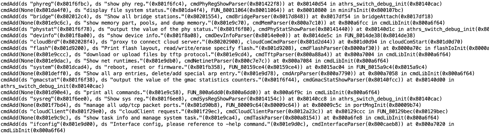
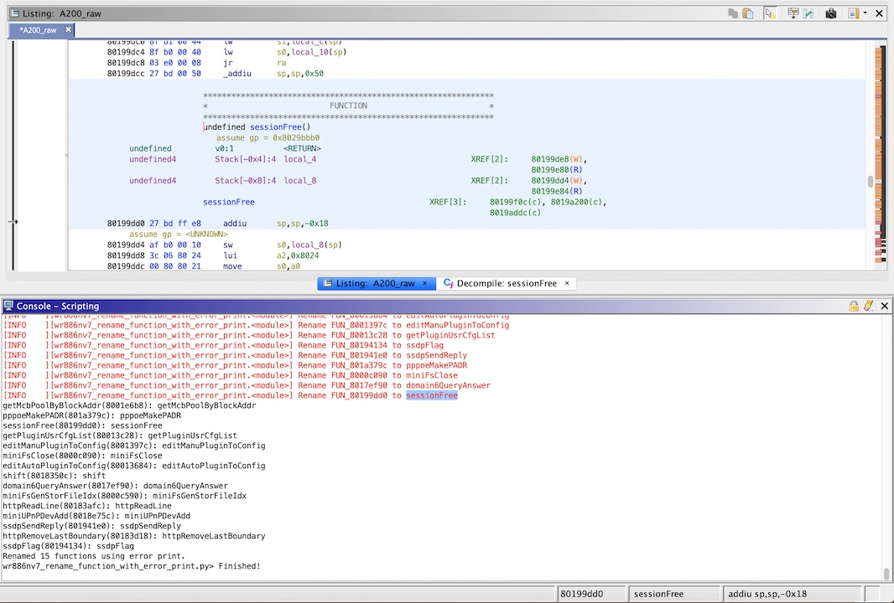
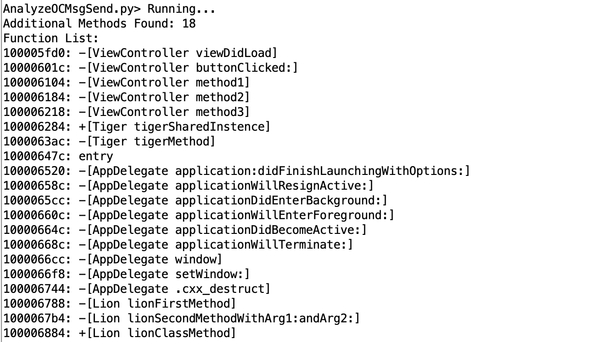
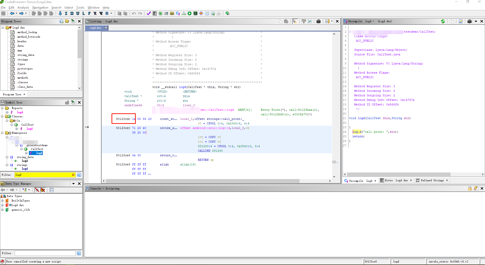
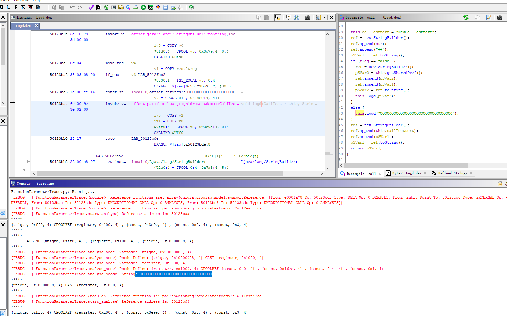
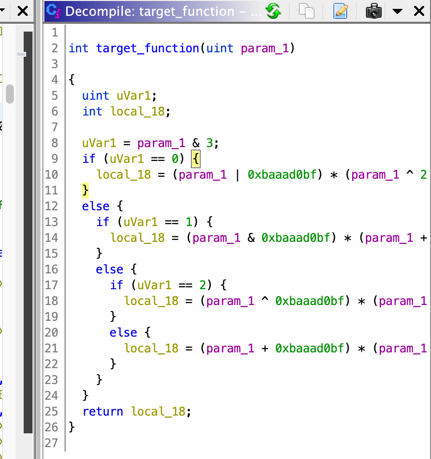

# ghidra_scripts
Scripts for the Ghidra software reverse engineering suite.

*Readme in other languages: [English](README.md), [简体中文](README.zh-cn.md)*

# Installation
In the Ghidra Script Manager click the "Script Directories" icon in the toolbar and add the checked out repository as a path.

# galaxy_utility
Some utility used by other Ghidra scripts.

# trace_function_call_parm_value.py
Trace Function call parameters value using Ghidra P-Code.

# wr886nv7_rename_function_with_error_print.py
Example script, rename undefined function with error print string.

[Detail steps](docs/wr886nv7_rename_function_with_error_print.md)

# AnalyzeOCMsgSend.py
Analyze Objective-C MsgSend using this script.

# DexFile_Parameter_Trace.py
Trace an Android Function parameters value using Ghidra P-Code.

## function logd 1st parameter trace

Provide target function's address and parameters index

Output

# ollvm_deobf_fla.py
Deobfuscating OLLVM control flow flattening.

Select the assembly for state var initialization in Ghidra code listing interface.

Then run the script for deobfuscation.

