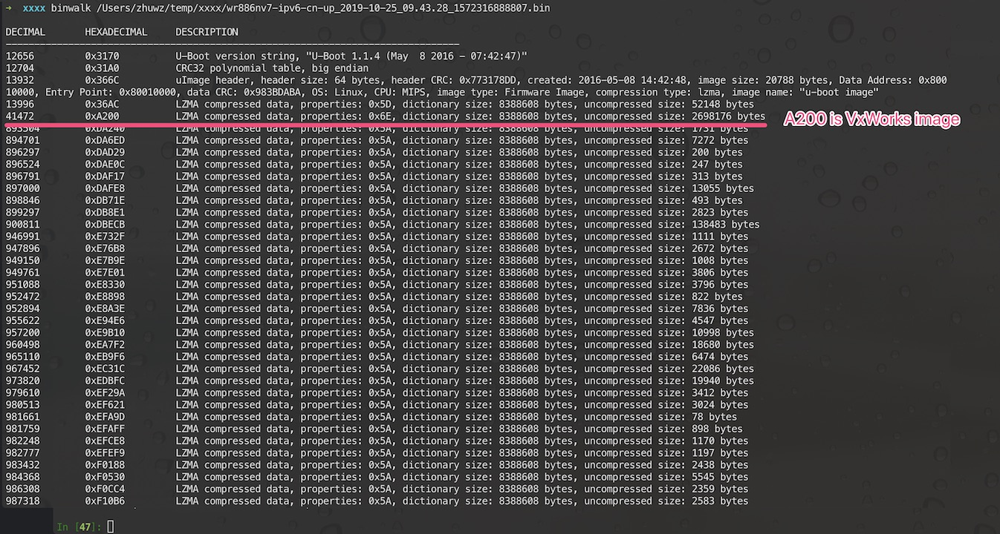
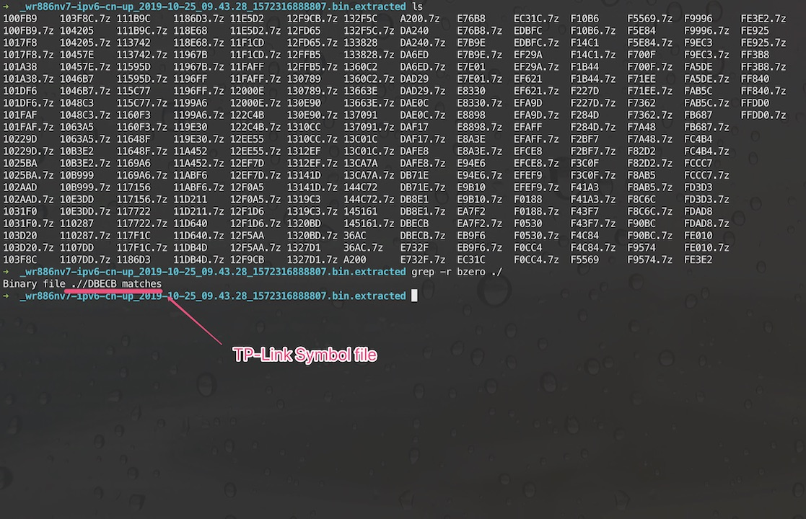
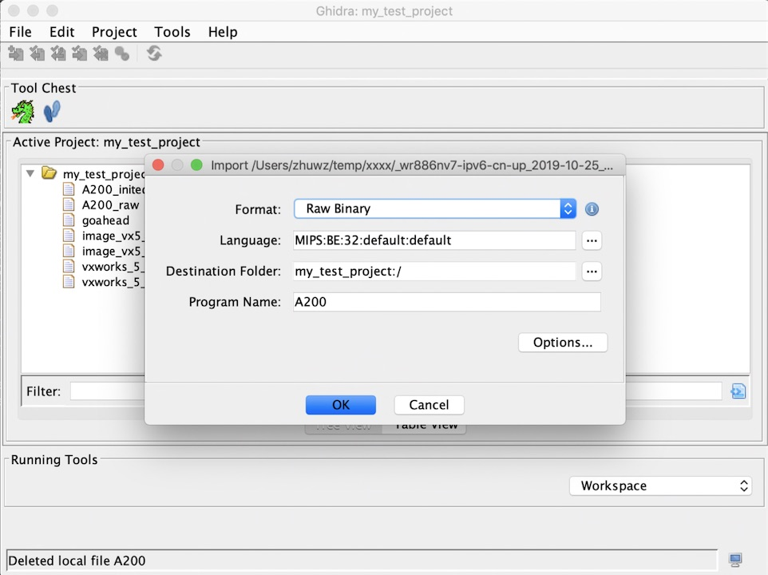
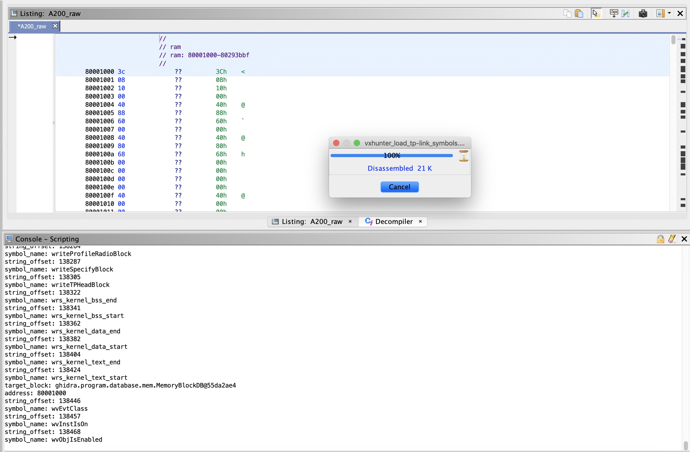

# Detail steps of demo script wr886nv7_rename_function_with_error_print.py

## step 1: Download wr886nv7 firmware and extract VxWorks image
You can download example wr886nv7 firmware [here](http://download.tplinkcloud.com.cn/firmware/wr886nv7-ipv6-cn-up_2019-10-25_09.43.28_1572316888807.bin).

Using binwalk to extract the firmware.

Find TP-Link external symbol file.

Load VxWorks image "A200" to Ghidra with MIPS Big endian processor type and default load address zero.

Don't analyze image this time, since we don't known the correct load address.

## step 2: Run VxHunter load tp-link symbols script

PS: You need install VxHunter first, VxHunter repository can be found [here](https://github.com/PAGalaxyLab/vxhunter)

Run VxHunter vxhunter_load_tp-link_symbols.py in script manager and select the TP-Link external symbol file "DBECB".  

This script will load TP-Link external symbol file, rebase image to correct load address and fix the function name.

## step 3: Run wr886nv7_rename_function_with_error_print.py

All done, you can now run wr886nv7_rename_function_with_error_print.py script.

This script will analyze functions error print and use it to rename undefined function.

